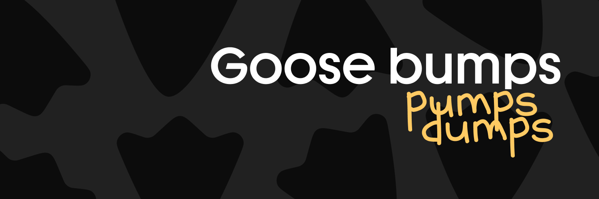
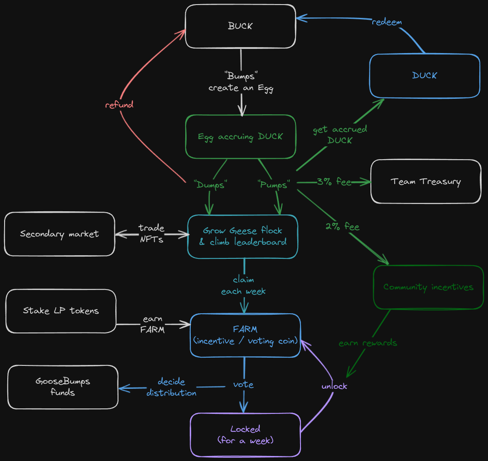

# Goose Bumps - Pump your $BUCK

## Overview

Goose Bumps is a pioneering experience seamlessly blending DeFi and GameFi elements on Sui. Inspired by Chicken Bonds, we've crafted a system that simplifies financial intricacies into an immersive gamified journey. 

The adventure begins by transforming financial stakes into ever-evolving dynamic NFTs - starting with Eggs as open bonds, and morphing into various forms of Geese to symbolize bond statuses. The ultimate challenge for users is to cultivate the most prosperous flock of geese and ducks in the ecosystem.

## Flow 

By depositing BUCK or SUI (swapped), users receive an Egg NFT, encapsulating financial venture. Eggs accrue DUCK, mirroring the growth of the investment. 

When the moment feels right, holders can make a move: "Pump" the Egg to hatch into a Pumped Goose, reaping the DUCK it has gathered, or "Dump" it to retrieve the initial deposit including a dose of FUD, transforming the NFT into a Dumped Goose. For those seeking the pinnacle of achievement, locking in DUCK unveil the illustrious Golden Goose.

At the heart of Goose Bumps is DUCK, a yielding stablecoin designed to capture the yield from BUCK investments across an array of protocols on Sui. The direction of BUCK flow will be governed by our community.

## Architecture

### Pond

**Pond**: the shared object at the center of the protocol, holding the state and managing the strategies.

**Strategy**: these objects are stored in the Pond VecMap. The heterogenous position objects (LP token or receipt) are attached to the strategy objects using dynamic fields. Accessors provide a common interface for creating and managing strategies.

### Strategies

Each is constructed in a separate module in ./strategies. They all follow the same pattern:  

1. *init_strategy*: used once by the admin. It creates a new Strategy, instantiates it with a Position object and store it in the Pond.
2. *deposit*: used during *bump*. The function calculate the share of the deposit to be allocated to this strategy. Then it withdraw the position from the protocol and add the deposit share to it, to finally deposit it back, effectively compounding the position.
3. *withdraw*: used during *dump*. It withdraws the position from the protocol if it has the lowest priority and return the user's deposit to his wallet.
4. *compound*: used during *pump*. It compounds the position to enable the correct amount of $DUCK to be minted.

### Actions 

Users interact with the protocol in one click, but within a PTB a lot of operations happen. Let's break it down:

**bump**: deposits BUCK receive an Egg NFT. The user calls `request_bump()`, issuing two hot potato `CompoundRequest` and `DepositRequest`. `DepositRequest` stores the BUCK deposit to be allocated in each strategy. `CompoundRequest` enforces the *deposit* function in each of the strategy to be called. Everytime a *deposit* is finalized, a receipt is added to the request. At the end of the PTB, `bump()` is called to verify the request' receipts against the Pond's strategies to finalize the transaction and return the NFT.

**dump**: withdraws initial BUCK and receive a Dumped Goose NFT. The user calls `request_dump()`, issuing `CompoundRequest` and `WithdrawalRequest`. This time, we enforce *withdraw* functions to be called. The `WithdrawalRequest` stores the BUCK to be sent back to the caller. The other request works the same way as for deposits. `dump()` is eventually triggered to destroy the hot potatoes.

**pump**: claims accrued DUCK and receive a Pumped Goose NFT. The user calls `request_compound()`, issuing `CompoundRequest`. Here it enforces the *compound* function in each of the strategy to be called. Receipts are added as well as the total BUCK currently in the Pond. Using this compounded amount, a certain amount of DUCK is minted to the user by calling `pump()`.

**redeem**: exchange DUCK for the corresponding BUCK amount. After calling `request_compound()`, the user calls `request_redeem()`, calculating the amount of BUCK to be returned and issuing a new `CompoundRequest` as well as a `WithdrawRequest`. Then the process is the same as for *dump*. At the end `redeem()` is called, DUCK is burnt and BUCK is sent to the user.

## License
This project is licensed under the MIT License - see the [LICENSE](LICENSE) file for details.

